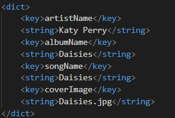

# MMPlayer
Nous avons développé cette application en Swift 5.0, compatible avec la version iOS 14.0. C'est un lecteur de MP3 dans lequel nous pouvons ajouter des musiques et les lires avec diverses fonctionnalités.

Dans le cadre des cours ITC44, nous avons travailler en binôme : Lucas MASSOT et Sam MAROUN en 4ème Année Informatique et Electronique Option SQR.

## Présentation Générale
Cette application est un lecteur de mp3 qui permet de réaliser les fonctionnalités suivantes:

- Lecture d'un fichier mp3.
- Affichage de l'image associée.
- Gestion d'un slider avec possibilité d'évolution dans la musique.
- Gestion de la playlist permettant d'avancer, de reculer, de répéter les musiques et également de les lire en aléatoire.
- Gestion d'une bibliothèque avec possibilité de rajout de musique (décrit un peu plus bas dans l'explication).

## Choix techniques
L'application est viable uniquement en mode portrait sur l'ensemble des modèles Apple.

Nous étions parti au départ sur l'utilisation de cocoapods qui possède beaucoup de librairie qui nous aurait permit de ne pas passer par un dictionnaire pour pouvoir lire nos musiques.

Nous n'avons pas créer de menu, l'utilisateur sera immédiatement sur la page de lecture de musique. C'est un véritéable choix de notre part qui est plus ergonomique pour l'utilisateur.

Le bouton menu, en bas à droite, n'est relié à aucune interaction, il est purement décoratif dans cette version nous n'avons pas pu le finaliser par manque de temps.

Certaines fonctionnalités, comme par exemple le fait de la lecture en background, non pas pu être testé du fait que nous n'avons pas de matériel sous iOS et que nous n'avions pas le son à cause de NoMachine. 

## Comment rajouter une musique ?

Pour rajouter des musiques, il faudra avoir les musiques au format mp3 ainsi que la "cover" de celle-ci au format jpg. Il faut les mettre à la racine du projet Xcode, puis, il faudra rajouter comme ci-dessous les noms des musiques, le nom de l'artiste ainsi que les noms des covers dans le fichier list.plist :

Par défaut, nous avons rajouté quelques musiques pour le test.

## Les améliorations qu'on pourrait apporter
Nous aurions voulu faire un mode paysage, avec une disposition différente du mode portrait ; nous pouvons généralement l'observer sur les applications du même genre.

Nous aurions voulu faire fonctionner le bouton menu, afin d'afficher la playlist au complet.

Nous aurions voulu rajouter une information sur les boutons "shuffle" et "repeat" pour indiquer que l'utilisateur à cliquer dessus.

Nous aurions également voulu rajouter une fonctionnalité permettant l'ajout automatique d'une musique à la bibliothèque en rajoutant un mp3 dans un dossier précis.

